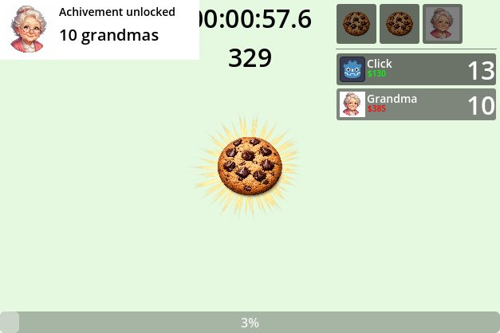
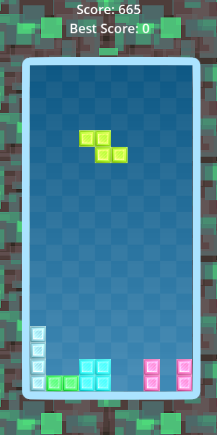
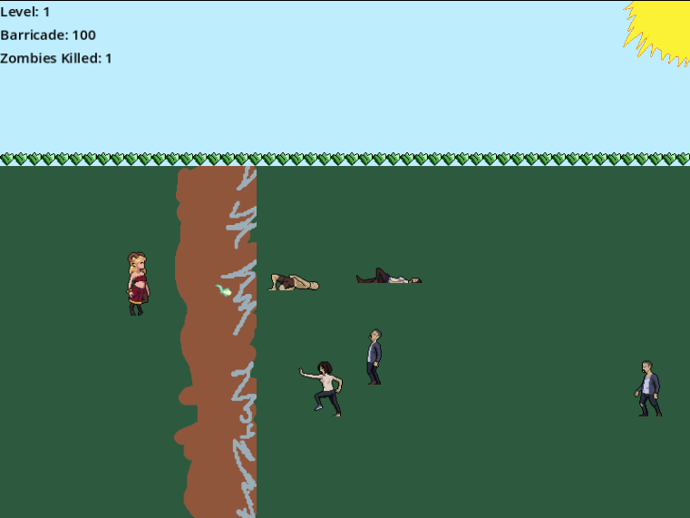
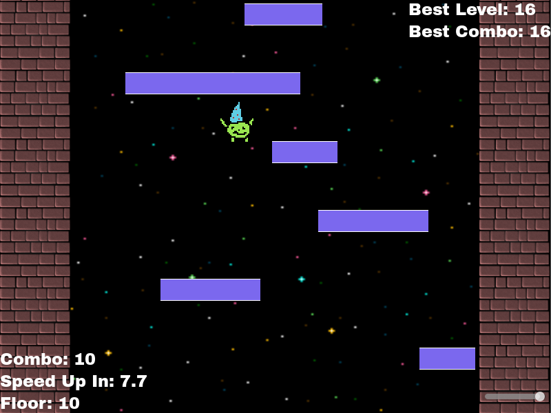

# Learning Projects

A collection of small projects created while learning Godot.

Projects (in order created):

## 1. `clicker` a clicker game where goal is to reach certain score as fast as possible

### What I learned
- Animated Buttons
- Dynamic UI components
- Animations using Tweening and AnimationPlayer
- Custom Button scenes
- Managing achievements and upgrade progression
- Win condition and restart loop
- Scene instancing and reusable UI
- Signals for UI/game flow
- Managing global game state and upgrades
- Floating text
- Audio feedback for clicks
- Separating data from game logic
- Utilising BitMap to create click masks
- Click-based income loop and passive income timers
### New Godot Nodes learned
Node, Control, ColorRect, VBoxContainer, Label, TextureButton, Timer, Sprite2D, AudioStreamPlayer2D, AnimationPlayer, GridContainer, HSeparator, Button, ProgressBar, HBoxContainer, TextureRect 
## 2. `tertis` a classic tetris game

### What I learned
- Grid based game logic
- Timer-driven movement
- Using SubViewport to clip VFX to the board area
- Tracking data across runs with a global singleton script
### New Godot Nodes learned
Node2D, AnimatedSprite2D, SubViewportContainer, SubViewport
## 3. `satyr vs zombies` survive increasingly hard waves of zombies, purchase upgrades, defend the barricade

### What I learned
- Player movement with viewport clamping and collisions
- Mouse-aimed combat
- Utilising sprite sheets to create animations
- Animation state transitioning
- Projectile spread cone math
- Projectile collision and explosion animation flow
- Basic enemy AI with state transitions
- Sampling enemy spawn points from Path2D and PathFollow2D
- Managing scene transitions
- Upgrade economy (resources, dynamic upgrade costs, stat growth)
- Custom mouse cursor
- Combat SFX integration
- Utilising TileMapLayer to draw objects
### New Godot Nodes learned
Area2D, CollisionShape2D, StaticBody2D, CharacterBody2D, TileMapLayer, Path2D, PathFollow2D
## 4. `tower`

### What I learned
- Parallax Scrolling
- Procedural platform generation with object pooling
- Using Scene Groups
- Physics based character movement, bouncing, gravity, acceleration
- Global audio settings
- Implementing basic shaders to modify pixel colors
- Texture smoothing using mipmaps and anisotropic filtering
- Score persistence
### New Godot Nodes learned
Parallax2D, Camera2D, AudioStreamPlayer