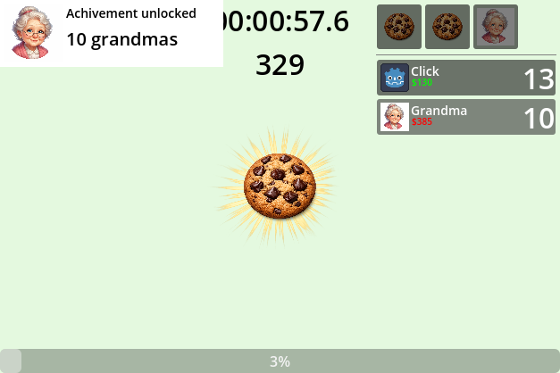
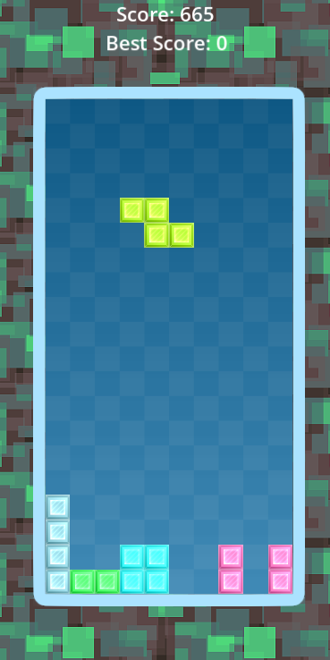
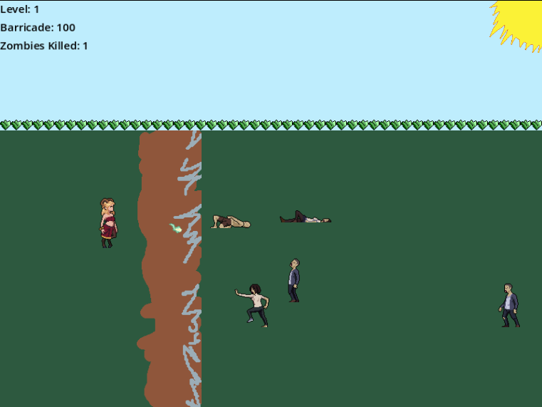
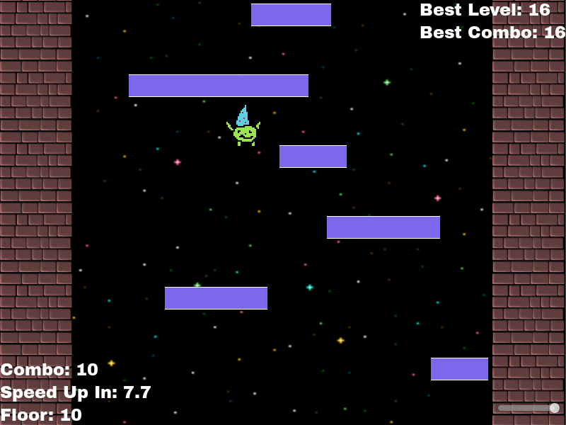
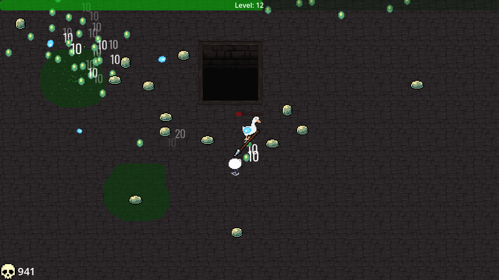
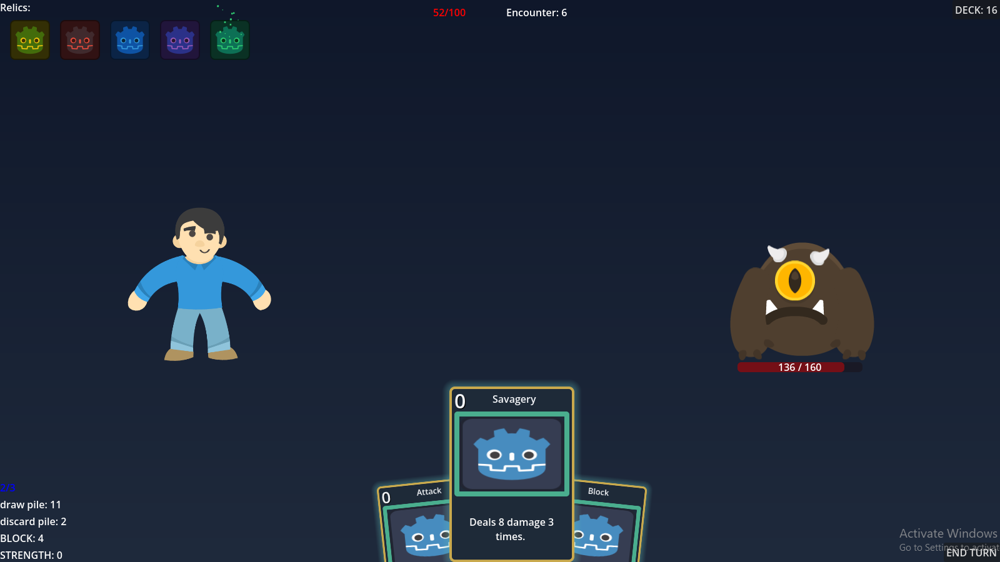

# Learning Projects

A collection of projects I made while learning Godot.

These are not fully finished games, just small playable POCs based on other games. Each one focuses on building most of the core mechanics, along with a gameplay loop and win/lose conditions where it made sense.

Projects are listed in creation order, oldest first.

## 1. `Clicker` - based on cookie clicker
2026-01-28 -> 2026-02-07

### What I learned
- Animated Buttons
- Dynamic UI components
- Animations using Tweening and AnimationPlayer
- Custom Button scenes
- Managing achievements and upgrade progression
- Win condition and restart loop
- Scene instancing and reusable UI
- Signals for UI/game flow
- Managing global game state and upgrades
- Floating text
- Audio feedback for clicks
- Separating data from game logic
- Utilising BitMap to create click masks
- Click-based income loop and passive income timers
### New Godot Nodes learned
Node, Control, ColorRect, VBoxContainer, Label, TextureButton, Timer, Sprite2D, AudioStreamPlayer2D, AnimationPlayer, GridContainer, HSeparator, Button, ProgressBar, HBoxContainer, TextureRect

## 2. `Blocks` - based on Tetris
2026-02-07 -> 2026-02-14

### What I learned
- Grid based game logic
- Timer-driven movement
- Using SubViewport to clip VFX to the board area
- Tracking data across runs with a global singleton script
### New Godot Nodes learned
Node2D, AnimatedSprite2D, SubViewportContainer, SubViewport

## 3. `Satyr vs Zombies` - based on Last Stand
2026-02-14 -> 2026-02-22

### What I learned
- Player movement with viewport clamping and collisions
- Mouse-aimed combat
- Utilising sprite sheets to create animations
- Animation state transitioning
- Projectile spread cone math
- Projectile collision and explosion animation flow
- Basic enemy AI with state transitions
- Sampling enemy spawn points from Path2D and PathFollow2D
- Managing scene transitions
- Upgrade economy (resources, dynamic upgrade costs, stat growth)
- Custom mouse cursor
- Combat SFX integration
- Utilising TileMapLayer to draw objects
### New Godot Nodes learned
Area2D, CollisionShape2D, StaticBody2D, CharacterBody2D, TileMapLayer, Path2D, PathFollow2D

## 4. `Tower` - based on Icy Tower
2026-02-22 -> 2026-02-27

### What I learned
- Parallax Scrolling
- Procedural platform generation with object pooling
- Using Scene Groups
- Physics based character movement, bouncing, gravity, acceleration
- Global audio settings
- Implementing basic shaders to modify pixel colors
- Texture smoothing using mipmaps and anisotropic filtering
- Score persistence
### New Godot Nodes learned
Parallax2D, Camera2D, AudioStreamPlayer

## 5. `Duck vs Slimes` - based on Vampire Survivors
2026-02-27 -> 2026-03-12

### What I learned
- item pickups
- agent pathfinding and avoidance (RVO)
- knockback
- attack types: cone sweeps, homing projectiles, orbital projectiles, explosions, damaging ground
- 3 chunk system for horizontal infinity
- weighted rarity system
- random upgrade offers
- floating damage text
- shader based hit flashes
- particle effects
- baking navigation meshes
### New Godot Nodes learned
PanelContainer, RichTextLabel, NavigationAgent2D, CPUParticles2D, GPUParticles2D, Polygon2D, CanvasLayer, NavigationRegion2D

## 6. `Cards` - based on Slay the Spire
2026-03-12 -> 2026-04-07

### What I learned
- custom Container layout to implement fan shaped hand of cards
- running code in the editor with @tool
- turn-based combat
- 2D model rigging
- inverse kinematics
- Control components for debugging
- anti aliasing (both global with msaa, and node specific)
- utilising StringName and NodePath instead of String for efficiency
- representing card effects with reusable action objects
- drag and drop card interactions with hover, tweening, and play validation
- event-driven combat system with relics that can modify or create combat actions
- global keyword highlighting with tooltips
### New Godot Nodes learned
Container, Skeleton2D, Bone2D, ScrollContainer, Panel

## 6. `Auto Battler` - based on Backpack Battles
2026-04-08 -> WIP

### What I learned
- 
### New Godot Nodes learned
